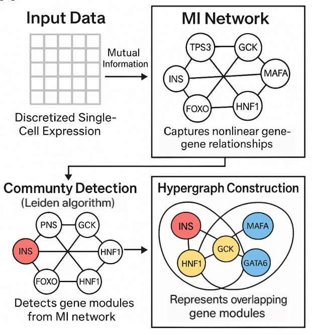

# miEdgeR

> Mutual-information based gene network analysis,  
> hypergraph construction & pseudotime-aware workflows  
> for single-cell RNA-seq data.

miEdgeR provides a streamlined pipeline for single‐cell RNA‐seq data that:

    Builds nonlinear gene–gene networks via mutual information

    Detects robust gene modules with the Leiden community algorithm

    Encodes overlapping modules as a hypergraph

    Quantifies module dynamics along pseudotime trajectories

[](LICENSE)

---



## Installation

You can install the development version from GitHub with:

```r
# install.packages("remotes")
remotes::install_github("iichelhadi/miEdgeR")
```

## Quick start

```r
# 1. Load libraries and data
library(Seurat)
library(miEdgeR)
library(igraph)
library(dplyr)
library(ggplot2)
library(ggraph)
library(flextable)

# Replace with your own file if needed:
seurat_obj <- readRDS("pbmc3k.rds")

# 2. Build the MI network for cluster "1"
result <- compute_mi_network(
  seurat_obj,
  cluster_id     = "1",
  cluster_field  = "RNA_snn_res.0.1",
  assay_name     = "RNA",
  min_expr_pct   = 0.05,
  top_n_genes    = 3000,
  n_cores        = parallel::detectCores()
)

# 3. Threshold at the 95th percentile
g <- build_mi_graph(
  result$mi_matrix,
  threshold_method = "percentile",
  percentile       = 0.95
)

# 4. Denoise via percolation
g_consensus <- percolate_graph(
  g,
  n_iterations   = 100,
  edge_fraction  = 0.6,
  freq_threshold = 0.5,
  percentile     = 0.95
)

# 5. Detect communities and make a hypergraph
communities <- detect_communities(g_consensus)
hg          <- make_hypergraph(communities)

# 6. Visualize the hypergraph
plot_hypergraph(hg, title = "Overlapping Gene Modules")
```

## Tutorials

- [MI Network and Hypergraph Analysis with miEdgeR](https://iichelhadi.github.io/miEdgeR/articles/mi_network_hypergraph.html)
- [Pseudotime-Aware MI Network Analysis with miEdgeR](https://iichelhadi.github.io/miEdgeR/articles/pseudotime_mi_network.html)


📌 This is a pre-publication version (v0.1.0) of `miEdgeR`.  
Please do not reuse or redistribute without permission.  
A citable version will be released upon manuscript acceptance.

